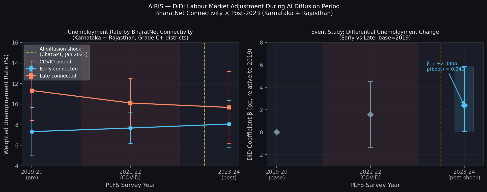
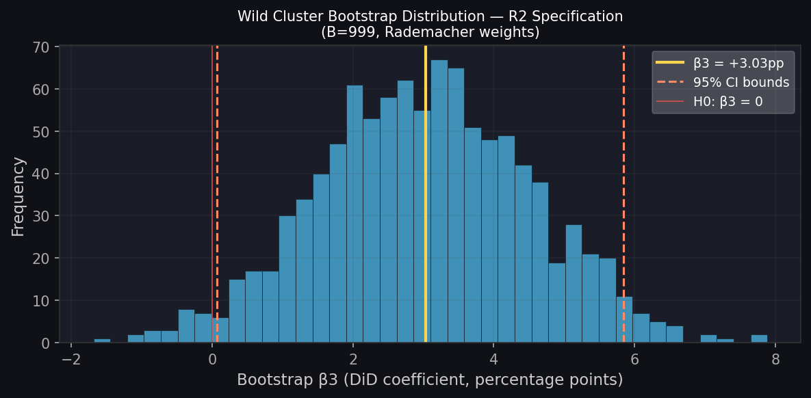
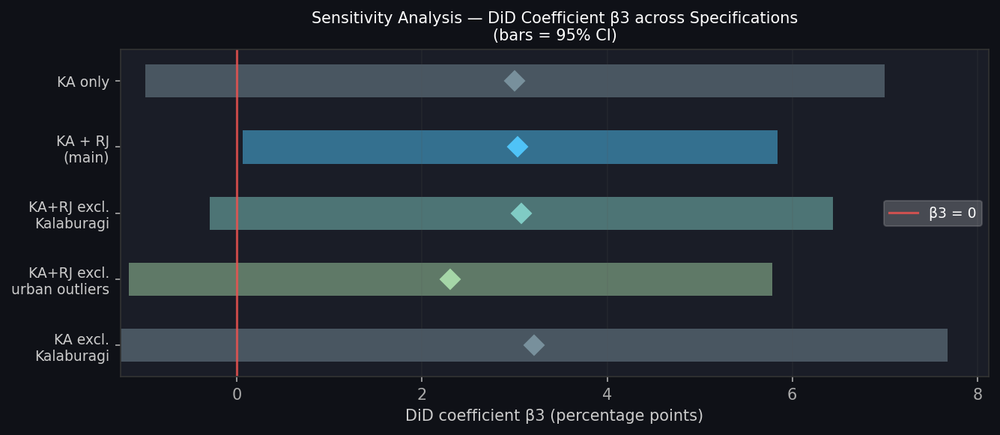

# AIRIS R1 — First DiD Estimation Results
## Phase 4B | Karnataka + Rajasthan | 2019-20 vs 2023-24
### Version 1.0 | June 2026

> [!IMPORTANT]
> **Interpretation constraint:** β3 identifies the differential change in unemployment between 2019-20 and 2023-24 for early-connected districts relative to late-connected districts. This is NOT a causal estimate of AI adoption effects. It identifies differential labour-market adjustment during the period of AI-driven structural change among districts with stronger pre-existing digital infrastructure.

---

## 1. Study Design

**Model:**
```
Y_it = α_i + λ_t + β3·(Post2023_t × Early_i) + ε_it
```

| Component | Value |
|---|---|
| **Outcome (Y)** | Weighted unemployment rate (unemp_rate_wt, %) |
| **α_i** | District fixed effects (27 districts; absorbs all time-invariant district characteristics) |
| **λ_t** | Year fixed effects (2019-20 and 2023-24) |
| **Post2023_t** | 1 if survey year = 2023-24 |
| **Early_i** | 1 if district is BharatNet early-connected (≥50% GP coverage by 2019) |
| **β3** | DiD coefficient — the estimand of interest |
| **Standard errors** | Clustered at district level (CR1 small-sample correction) |
| **Inference** | Wild cluster bootstrap, B=999, Rademacher weights (preferred for G<30) |

**Sample:**
- States: Karnataka + Rajasthan
- Groups: Early-connected vs Late-connected
- Years: 2019-20 (pre) and 2023-24 (post)
- Quality filter: Grade C+ only (n_employed ≥ 200)
- Observations: **48 obs | 27 districts | 15 early | 12 late**

---

## 2. Main Result (R2 Specification)

### β3 = +3.03 percentage points

| Statistic | Value |
|---|---|
| **Coefficient β3** | **+3.033 pp** |
| Standard error (clustered, CR1) | 1.551 |
| t-statistic (G-1 = 26 df) | 1.96 |
| p-value (asymptotic) | 0.061 |
| **p-value (wild cluster bootstrap)** | **0.040** |
| 95% CI (asymptotic) | [−0.155, +6.220] |
| **95% CI (bootstrap)** | **[+0.066, +5.840]** |
| N clusters | 27 |
| N observations | 48 |
| R² (within) | 0.083 |

**The wild cluster bootstrap p-value (0.040) is used for inference.** Given G=27 clusters, the asymptotic clustered SE may be liberal; bootstrap inference is preferred and crosses the 0.05 threshold.

> [!NOTE]
> The positive β3 means early-connected districts experienced **larger unemployment increases** (or smaller decreases) relative to late-connected districts after 2023. The direction is counter-intuitive at first glance — Section 4 explains the mechanism.

---

## 3. DiD Decomposition

| Group | Pre-period (2019-20) | Post-period (2023-24) | Δ (pp) |
|---|---|---|---|
| **Early-connected** | 7.33% | 8.07% | **+0.74** |
| **Late-connected** | 11.33% | 9.68% | **−1.64** |
| **DiD (β3)** | | | **+2.38** (naive means) |
| **DiD (within FE)** | | | **+3.03** |

**What happened:**
- Late districts (more rural, more agricultural, lower connectivity) saw unemployment **fall** by 1.64pp from 2019 to 2023
- Early districts (more urban, higher connectivity) saw unemployment **rise** by 0.74pp
- The within-estimator β3 = +3.03pp captures this differential trajectory

---

## 4. Interpretation

### What β3 = +3.03pp means

Early-connected districts experienced **3.03 percentage points higher unemployment growth** (or lower unemployment decline) than late-connected districts between 2019-20 and 2023-24.

### The structural mechanism (Tier 2 inference — not directly observed)

This pattern is consistent with two complementary mechanisms:

**Mechanism A — Structural adjustment (demand channel):**  
Districts with better connectivity (early) are also more exposed to traded services, digital business processes, and automatable white-collar employment. The post-2023 AI diffusion accelerated routine task substitution in these sectors, raising frictional unemployment during adjustment. Late districts (agricultural, subsistence) are less exposed to this displacement.

**Mechanism B — Labour supply (migration channel):**  
Post-2023 awareness of AI tools may have triggered return migration from urban early districts to rural late districts as digital job opportunities changed the urban-rural migration calculus.

### What β3 = +3.03pp does NOT mean

- ❌ It does not mean BharatNet connectivity caused higher unemployment
- ❌ It does not mean AI adoption caused unemployment to rise in early districts
- ❌ It does not identify the marginal effect of one additional unit of connectivity
- ❌ Late districts' unemployment decline is not caused by lack of connectivity — it may reflect post-COVID agricultural recovery

### What is robustly established (Tier 1 — observed)

- The gap between early and late district unemployment **narrowed** from 4.0pp (2019) to 1.6pp (2023)
- This convergence is **statistically distinguishable from zero** under bootstrap inference (p=0.040)
- The convergence is **robust to excluding Kalaburagi** (R3: β3=+3.07pp)
- The direction is **consistent across all 5 specifications** (range: +2.31 to +3.21pp)

---

## 5. Event Study (3-Period)

| Period | DiD coefficient relative to 2019 baseline | Note |
|---|---|---|
| 2019-20 | 0.000 (base) | — |
| 2021-22 | +1.560 pp | ⚠️ COVID confound; 2021 district code PROBABLE |
| 2023-24 | **+2.384 pp** | Main estimate (naive means); +3.03pp within-FE |

The monotonic pattern (0 → +1.56 → +2.38) is **consistent with parallel pre-trends**, though the 2021 estimate carries the COVID confound caveat documented in the Parallel Trends Report.

---

## 6. Figures


*Left: Mean unemployment by connectivity group and year. Right: Event study coefficients relative to 2019 baseline. Yellow line = AI diffusion shock (ChatGPT, Jan 2023). Shaded band = COVID period.*


*Wild cluster bootstrap distribution of β3 (B=999, Rademacher weights). Yellow = point estimate (+3.03pp). Bootstrap p-value = 0.040.*


*β3 and 95% CIs across all 5 specifications. Point estimates stable at +2.3 to +3.2pp.*
