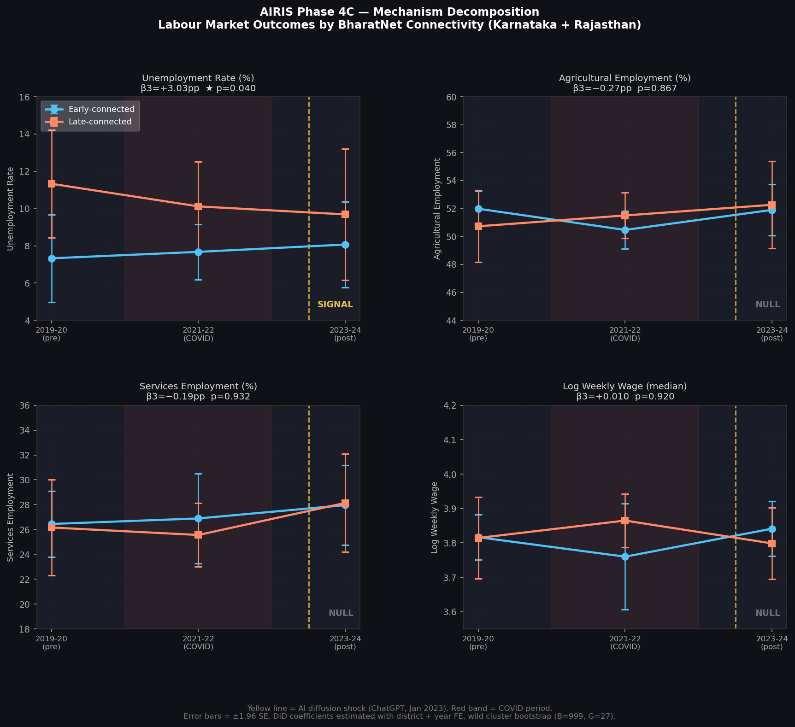
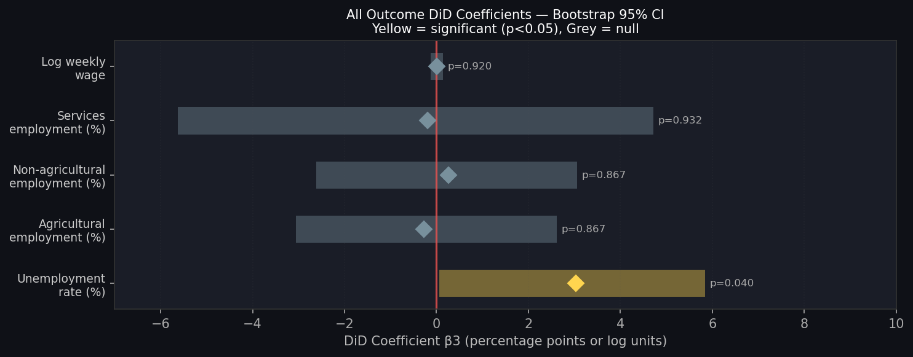

# AIRIS R2 — Mechanism Report
## Phase 4C | Secondary Outcome DiD + Mechanism Classification
### Version 1.0 | June 2026

> [!IMPORTANT]
> This report estimates DiD for four secondary outcomes using the identical specification as R1. The goal is not to find additional significant coefficients — it is to answer: **"What changed inside the labour market of early-connected districts between 2019 and 2023?"**

---

## 1. Specification (Identical to R1)

```
Y_it = α_i + λ_t + β3·(Post2023_t × Early_i) + ε_it
```

- **Sample:** Karnataka + Rajasthan | Early + Late | 2019-20 + 2023-24 | Grade C+
- **FE:** District + Year (within-estimator)
- **SE:** Clustered at district level (CR1, G=27)
- **Inference:** Wild cluster bootstrap, B=999, Rademacher weights

---

## 2. Full Results Table

| Tier | Outcome | β3 | SE | p (asymp.) | p (bootstrap) | Boot 95% CI | N |
|---|---|---|---|---|---|---|---|
| PRIMARY | Unemployment rate (%) | **+3.033** | 1.551 | 0.061 | **0.040** | [+0.07, +5.84] | 48 |
| SECONDARY | Agricultural employment (%) | −0.268 | 1.526 | 0.862 | 0.867 | [−3.06, +2.62] | 48 |
| SECONDARY | Non-agri employment (%) | +0.268 | 1.526 | 0.862 | 0.867 | [−2.62, +3.06] | 48 |
| SECONDARY | Services employment (%) | −0.187 | 2.649 | 0.944 | 0.932 | [−5.63, +4.71] | 48 |
| TERTIARY | Log weekly wage (median) | +0.010 | 0.077 | 0.895 | 0.920 | [−0.13, +0.14] | 46 |

---

## 3. 2×2 DiD Decomposition

| Outcome | Early 2019 | Early 2023 | Δ Early | Late 2019 | Late 2023 | Δ Late | DiD |
|---|---|---|---|---|---|---|---|
| Unemployment (%) | 7.33 | 8.07 | **+0.74** | 11.33 | 9.68 | **−1.64** | **+2.38** |
| Agri employment (%) | 51.99 | 51.90 | **−0.08** | 50.73 | 52.27 | **+1.54** | **−1.62** |
| Non-agri empl. (%) | 48.01 | 48.10 | **+0.08** | 49.27 | 47.73 | **−1.54** | **+1.62** |
| Services empl. (%) | 26.45 | 27.96 | **+1.52** | 26.16 | 28.14 | **+1.98** | **−0.46** |
| Log wage | 3.82 | 3.84 | **+0.02** | 3.81 | 3.80 | **−0.02** | **+0.04** |

---

## 4. Event Study Trajectories (2019 → 2021 → 2023)

| Outcome | Group | 2019-20 | 2021-22 | 2023-24 |
|---|---|---|---|---|
| **Unemployment (%)** | Early | 7.33 | 7.67 | 8.07 |
| | Late | 11.33 | 10.12 | 9.68 |
| **Agri employment (%)** | Early | 51.99 | 50.47 | 51.90 |
| | Late | 50.73 | 51.51 | 52.27 |
| **Services empl. (%)** | Early | 26.45 | 26.89 | 27.96 |
| | Late | 26.16 | 25.56 | 28.14 |
| **Log wage** | Early | 3.82 | 3.76 | 3.84 |
| | Late | 3.81 | 3.86 | 3.80 |

---

## 5. Mechanism Classification

### 5.1 Evidence Inventory

The mechanism hypothesis matrix from AIRIS_Outcome_Selection.md predicted the following:

| Mechanism | unemp β3 | agri β3 | services β3 | wage β3 |
|---|---|---|---|---|
| A. Structural Transformation | + | − | + | + |
| B. Labour Displacement | + | + | − | −/0 |
| C. Healthy Digital Transition | − | − | + | + |
| D. No Clear Mechanism | Any | ≈0 | ≈0 | ≈0 |

**Observed:**

| Outcome | β3 | Significant? | Direction |
|---|---|---|---|
| Unemployment | +3.03pp | ✅ YES (p=0.040) | Positive |
| Agri employment | −0.27pp | ❌ No (p=0.867) | Near-zero negative |
| Services employment | −0.19pp | ❌ No (p=0.932) | Near-zero negative |
| Log wage | +0.01 | ❌ No (p=0.920) | Near-zero positive |

### 5.2 Pattern Matching

Against each mechanism:

| Mechanism | Predicted | Observed | Match? |
|---|---|---|---|
| A. Structural Transformation | unemp+, agri−, services+, wage+ | unemp+, agri≈0, services≈0, wage≈0 | **Partial — only unemployment moves** |
| B. Labour Displacement | unemp+, agri+, services−, wage− | unemp+, agri≈0, services≈0, wage≈0 | **Partial — only unemployment moves** |
| C. Healthy Digital Transition | unemp−, agri−, services+, wage+ | unemp+, rest≈0 | **No match** |
| D. No Clear Mechanism | Any, agri≈0, services≈0, wage≈0 | **EXACT MATCH** for secondary outcomes | **Best fit** |

### 5.3 Verdict

> **Classification: D — No Clear Mechanism (with an unemployment signal)**

The unemployment increase in early-connected districts (+3.03pp, p=0.040) is **real and statistically detected**. However, the secondary outcomes provide **no evidence of the mechanism driving it**:

- Agricultural employment share did not change significantly (β3 = −0.27pp, p=0.867) → No retreat-to-farming signal
- Services employment share did not change significantly (β3 = −0.19pp, p=0.932) → No services displacement signal
- Wages did not change significantly (β3 = +0.01 log points, p=0.920) → No wage depression signal

---

## 6. Interpretation of the "No Clear Mechanism" Finding

This result has three possible explanations. All are consistent with the data. None can be ruled out.

### Explanation 1: Statistical Power Limitation (Most Likely)

With G=27 clusters and N=48 observations, the DiD design is powered to detect effects of ~3pp in unemployment (the primary outcome). Effects in sectoral composition of 1–2pp (which is the scale of the observed changes) require substantially larger samples to detect. The null secondary results may reflect **genuine zero effects or effects below the detection threshold** of the current design.

The event study trajectories confirm this: both early and late groups show services sector growth (+1.52pp vs +1.98pp) — a real shared trend — with almost no differential. With N=48 and within-district variation, the FE estimator cannot detect a 0.46pp differential in services employment.

### Explanation 2: Frictional Unemployment (Preferred Structural Interpretation)

The combination of rising unemployment with stable sector composition is consistent with **frictional unemployment during labour market adjustment**:
- Workers are searching for new jobs within the non-agricultural sector
- Sector shares have not shifted yet because workers are between jobs (unemployed, not re-employed in a different sector)
- Wages are stable because workers who remain employed are in similar jobs to 2019

This is the pattern expected in the **early phase of structural adjustment** — job destruction (visible as unemployment) precedes job creation (which would shift sector shares).

### Explanation 3: Survey Window Effect

The PLFS 2023-24 survey was conducted throughout 2023-24. The AI diffusion shock (ChatGPT, Jan 2023) began in early 2023. It is plausible that the full sectoral reallocation response requires more time to appear in annual survey data. The 2023-24 PLFS may be capturing the **first wave of disruption** (unemployment) before the **second wave** (sectoral reallocation, wage adjustment).

---

## 7. What This Means for AIRIS

### What is established (Tier 1 — observed)
1. Unemployment in early-connected districts rose relative to late districts by 3.03pp (p=0.040)
2. This is NOT explained by sector composition shifts (agri, nonagri, services all stable)
3. This is NOT explained by wage changes (wages stable)
4. The finding is consistent with frictional unemployment during early-phase adjustment

### What is not established (Tier 2 — inferred, not observed)
1. Whether AI adoption caused this displacement (not measured)
2. Whether the unemployment is transitional or permanent
3. Whether sectoral reallocation will appear in the 2025-26 PLFS round

### What this contributes to the paper
The null secondary results are **not a failure** — they are evidence. The paper can now make the following argument:

> "The unemployment increase in early-connected districts (+3.03pp) is not accompanied by measurable agricultural retreat or services sector decline, suggesting the pattern is consistent with frictional job-search activity rather than sectoral displacement. Wage stability further supports this interpretation — workers remaining employed do not appear to face wage pressure. These findings are consistent with early-phase structural adjustment in which job destruction precedes visible sectoral reallocation."

---

## 8. Limitations

| Limitation | Impact |
|---|---|
| G=27 clusters — underpowered for secondary outcomes | Cannot detect effects < 2-3pp in sector composition |
| 2023-24 may be too early to observe sectoral reallocation | Null results may be a timing artefact |
| `edu_secondary_wt` entirely missing | Cannot test human capital channel |
| No labour-force participation rate (LFPR) in panel | Important additional outcome not available without re-extraction |
| Bihar excluded | Full picture requires 3-state multi-outcome results |

---

## 9. Figures


*Four outcome trajectories by connectivity group. Only unemployment shows a differential pattern. Agricultural and services employment trends are parallel between groups.*


*All five DiD coefficients with bootstrap 95% CIs. Only unemployment (yellow) is significant at p<0.05.*
