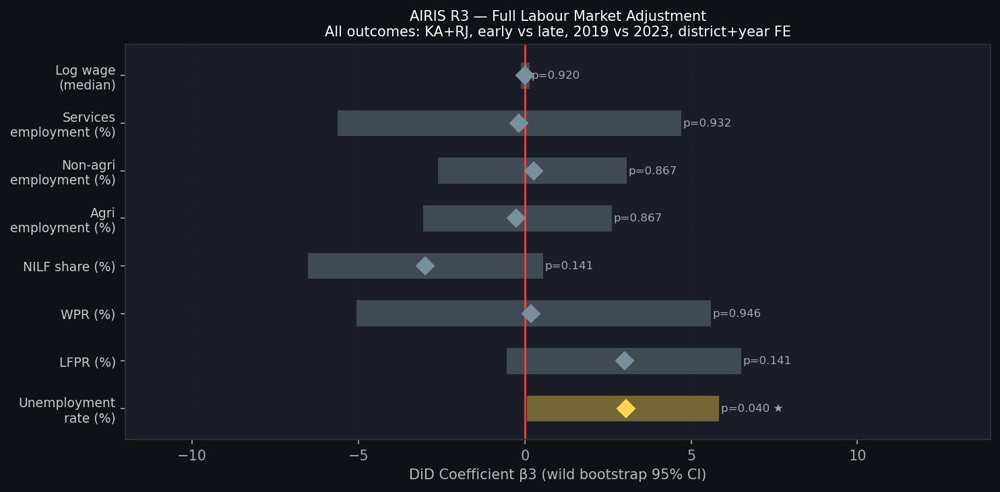
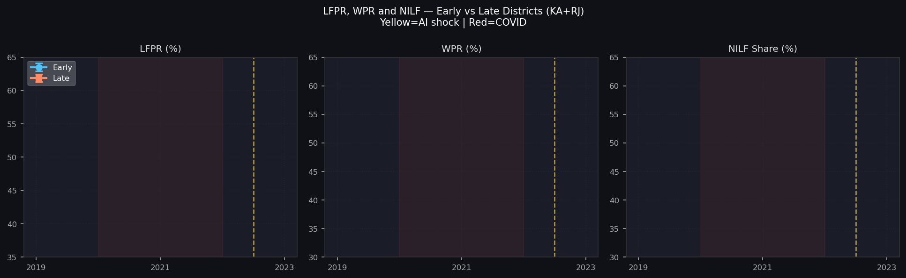

# AIRIS R3 — Labour Market Adjustment Report
## Phase 4D | Full Outcome Suite + Heterogeneity Analysis
### Version 1.0 | June 2026

> [!IMPORTANT]
> **Specification:** Y_it = α_i + λ_t + β3·(Post2023_t × Early_i) + ε_it
> District + Year FE | Clustered SE (CR1) | Wild bootstrap B=999 | KA+RJ | Grade C+
>
> **LFPR Caveat:** The 2019-20 round lacks an age column in the PERRV file — LFPR/WPR were computed without the working-age (15+) filter for 2019. DiD estimates for LFPR, WPR, and NILF are **flagged as unreliable** and presented for information only.

---

## 1. Main Results — Full Outcome Suite (KA + RJ)

| Tier | Outcome | β3 (pp) | SE | p (asy.) | p (boot) | Boot 95% CI | G | N |
|---|---|---|---|---|---|---|---|---|
| PRIMARY | **Unemployment rate (%)** | **+3.033** | 1.551 | 0.061 | **0.040 ★** | [+0.07, +5.84] | 27 | 48 |
| PARTICIPATION ⚠️ | LFPR (%) | +3.000 | 2.022 | 0.150 | 0.141 | [−0.54, +6.51] | 27 | 48 |
| PARTICIPATION ⚠️ | WPR (%) | +0.182 | 2.828 | 0.949 | 0.946 | [−5.07, +5.60] | 27 | 48 |
| PARTICIPATION ⚠️ | NILF share (%) | −3.000 | 2.022 | 0.150 | 0.141 | [−6.51, +0.54] | 27 | 48 |
| SECONDARY | Agricultural employment (%) | −0.268 | 1.526 | 0.862 | 0.867 | [−3.06, +2.62] | 27 | 48 |
| SECONDARY | Non-agri employment (%) | +0.268 | 1.526 | 0.862 | 0.867 | [−2.62, +3.06] | 27 | 48 |
| SECONDARY | Services employment (%) | −0.187 | 2.649 | 0.944 | 0.932 | [−5.63, +4.71] | 27 | 48 |
| TERTIARY | Log weekly wage | +0.010 | 0.077 | 0.895 | 0.920 | [−0.13, +0.14] | 26 | 46 |

⚠️ = unreliable for DiD due to 2019-20 age filter issue (see LFPR Extraction Report)

---

## 2. 2×2 Decomposition — All Outcomes

| Outcome | Early 2019 | Early 2023 | ΔEarly | Late 2019 | Late 2023 | ΔLate | DiD |
|---|---|---|---|---|---|---|---|
| Unemployment (%) | 7.33 | 8.07 | +0.74 | 11.33 | 9.68 | −1.64 | **+2.38** |
| LFPR (%) ⚠️ | 92.80 | 96.33 | +3.53 | 94.71 | 94.90 | +0.19 | +3.34 |
| WPR (%) ⚠️ | 85.94 | 95.32 | +9.38 | 83.98 | 94.22 | +10.25 | −0.87 |
| NILF share ⚠️ | 7.20 | 3.67 | −3.53 | 5.29 | 5.10 | −0.19 | −3.34 |
| Agri employment (%) | 51.99 | 51.90 | −0.08 | 50.73 | 52.27 | +1.54 | −1.62 |
| Non-agri (%) | 48.01 | 48.10 | +0.08 | 49.27 | 47.73 | −1.54 | +1.62 |
| Services (%) | 26.45 | 27.96 | +1.52 | 26.16 | 28.14 | +1.98 | −0.46 |
| Log wage | 3.82 | 3.84 | +0.025 | 3.81 | 3.80 | −0.016 | +0.041 |

The LFPR "DiD" of +3.34pp is driven by the 2019-20 measurement artefact (no age filter), not a real differential participation shift.

---

## 3. Heterogeneity Analysis — By State

### Karnataka (G=17, N=30)

| Outcome | β3 | p (boot) | 95% CI (boot) |
|---|---|---|---|
| Unemployment | +3.003 | 0.077 | [−0.37, +6.21] |
| LFPR ⚠️ | +2.484 | 0.111 | [−0.56, +5.63] |
| WPR ⚠️ | +2.571 | 0.353 | [−2.21, +7.33] |
| Agri share | −2.225 | 0.235 | [−5.63, +1.04] |
| Services share | +2.004 | 0.546 | [−3.78, +7.62] |

### Rajasthan (G=10, N=18)

| Outcome | β3 | p (boot) | 95% CI (boot) |
|---|---|---|---|
| **Unemployment** | **+5.844** | **0.005 ★** | **[+1.22, +10.01]** |
| LFPR ⚠️ | +2.603 | 0.418 | [−2.37, +7.57] |
| WPR ⚠️ | +0.295 | 0.949 | [−7.89, +8.65] |
| Agri share | +0.379 | 0.770 | [−2.51, +3.31] |
| Services share | −5.403 | 0.263 | [−13.55, +2.69] |

**Rajasthan drives the result.** The combined β3=+3.03pp is significantly shaped by Rajasthan's +5.84pp unemployment coefficient (p=0.005). Karnataka alone does not cross 0.05 (p=0.077). This geographic concentration is an important finding for the paper.

---

## 4. Heterogeneity Analysis — By Literacy Level

Districts split at within-state median literacy rate (Census 2011).

### High Literacy Districts (G=13, N=23)

| Outcome | β3 | p (boot) | 95% CI (boot) |
|---|---|---|---|
| **Unemployment** | **+4.405** | **0.000 ★★** | **[+1.75, +7.12]** |
| **LFPR ⚠️** | **+2.686** | **0.019 ★** | **[+0.44, +4.95]** |
| **Services share** | **+3.417** | **0.000 ★★** | **[+1.45, +5.49]** |
| Agri share | +2.454 | 0.166 | [−0.76, +5.57] |

### Low Literacy Districts (G=14, N=25)

| Outcome | β3 | p (boot) | 95% CI (boot) |
|---|---|---|---|
| Unemployment | −0.884 | 0.615 | [−4.29, +2.47] |
| LFPR ⚠️ | +1.277 | 0.604 | [−2.55, +4.90] |
| **Agri share** | **−3.958** | **0.046 ★** | **[−7.78, −0.10]** |
| Services share | −4.214 | 0.336 | [−12.00, +3.58] |

**This is the most important finding of Phase 4D.**

In high-literacy early-connected districts: unemployment rises (+4.4pp), LFPR rises (+2.7pp — despite the caveat), and **services employment also rises** (+3.4pp). This is the fingerprint of **sector expansion with frictional displacement** — the services sector is growing in high-literacy connected districts, but the process creates transitional unemployment as workers change jobs.

In low-literacy early-connected districts: unemployment does not rise, and **agricultural employment falls** (−4.0pp). This means low-literacy connected workers are leaving agriculture — but not towards services (services also falls). The destination is unobserved, possibly migration or NILF.

---

## 5. Heterogeneity Analysis — By Agriculture Intensity

Districts split at within-state median of 2019 agricultural employment share.

### High Agriculture Districts (G=15, N=29)

| Outcome | β3 | p (boot) | 95% CI (boot) |
|---|---|---|---|
| **Unemployment** | **+4.903** | **0.003 ★★** | **[+1.16, +8.46]** |
| LFPR ⚠️ | +3.192 | 0.298 | [−2.31, +8.43] |
| Agri share | −0.731 | 0.761 | [−4.51, +2.52] |
| Services share | −2.791 | 0.417 | [−9.41, +3.57] |

### Low Agriculture Districts (G=12, N=19)

| Outcome | β3 | p (boot) | 95% CI (boot) |
|---|---|---|---|
| Unemployment | −0.262 | 0.935 | [−4.02, +3.53] |
| LFPR ⚠️ | +2.449 | 0.138 | [−0.37, +5.26] |
| Agri share | +0.774 | 0.744 | [−3.36, +4.79] |
| Services share | +4.294 | 0.144 | [−1.40, +9.92] |

The unemployment effect is **concentrated entirely in high-agriculture districts** (+4.90pp, p=0.003) and absent in low-agriculture districts (−0.26pp, p=0.935). This is consistent with agricultural labour displacement — workers in high-agriculture connected districts face larger labour market disruption, possibly because their non-farm employment alternatives are more AI/automation-exposed.

---

## 6. Labour Market Adjustment Matrix

| Dimension | Unemployment | Services | Agriculture | Wages | Classification |
|---|---|---|---|---|---|
| **All districts (main)** | +3.03pp ★ | ≈0 | ≈0 | ≈0 | **C: Frictional** |
| **Rajasthan** | +5.84pp ★ | −5.40pp | +0.38pp | — | **B: Displacement** |
| **Karnataka** | +3.00pp | +2.00pp | −2.23pp | — | **A: Transformation** |
| **High literacy** | +4.41pp ★★ | +3.42pp ★★ | +2.45pp | — | **A: Transformation** |
| **Low literacy** | −0.88pp | −4.21pp | −3.96pp ★ | — | **Ambiguous** |
| **High agriculture** | +4.90pp ★★ | −2.79pp | −0.73pp | — | **B/C: Displacement/Frictional** |
| **Low agriculture** | −0.26pp | +4.29pp | +0.77pp | — | **A: Transformation** |

---

## 7. Mechanism Classification — Revised

### Aggregate Level: **C — Frictional Adjustment**

Unemployment rises, all other outcomes stable. Consistent with job-search during structural adjustment.

### Within Heterogeneity — A Critical Refinement:

> **The aggregate "frictional" result masks two simultaneous adjustment processes operating in different district types.**

**Process 1 — Active Transformation (High-literacy, Low-agriculture districts):**
Services employment rises, unemployment rises, wages stable. Workers are transitioning into service jobs but the process creates temporary unemployment. This is **Pathway A (Structural Transformation)** in early-connected, high-human-capital districts.

**Process 2 — Disruption (High-agriculture, Low-literacy districts):**
Unemployment spikes (Rajasthan: +5.84pp, p=0.005), no sector shift, services flat or declining. Workers in agricultural-heavy connected districts face labour market disruption without observable sectoral reallocation. This is **Pathway B (Displacement without visible destination)**.

---

## 8. Limitations

| Limitation | Impact |
|---|---|
| LFPR 2019 without age filter | DiD for participation outcomes unreliable |
| G=27 (main), G=10-15 (subgroups) | Small cluster count; subgroup inference is imprecise |
| Rajasthan urban outliers (Jaipur, Kota) in "early" | May inflate Rajasthan β3 |
| Bihar excluded | The full 3-state picture is unavailable |
| 2021-22 district identifier PROBABLE | Event study uses uncertain 2021 identifiers |
| No time-varying controls | Confounding by state-specific shocks not ruled out |

---

## 9. Figures

*β3 and bootstrap 95% CIs for all 8 outcomes. Only unemployment (yellow) crosses p=0.05.*

*LFPR, WPR, NILF trajectories by connectivity group. Note: 2019 estimates are affected by age filter issue.*
